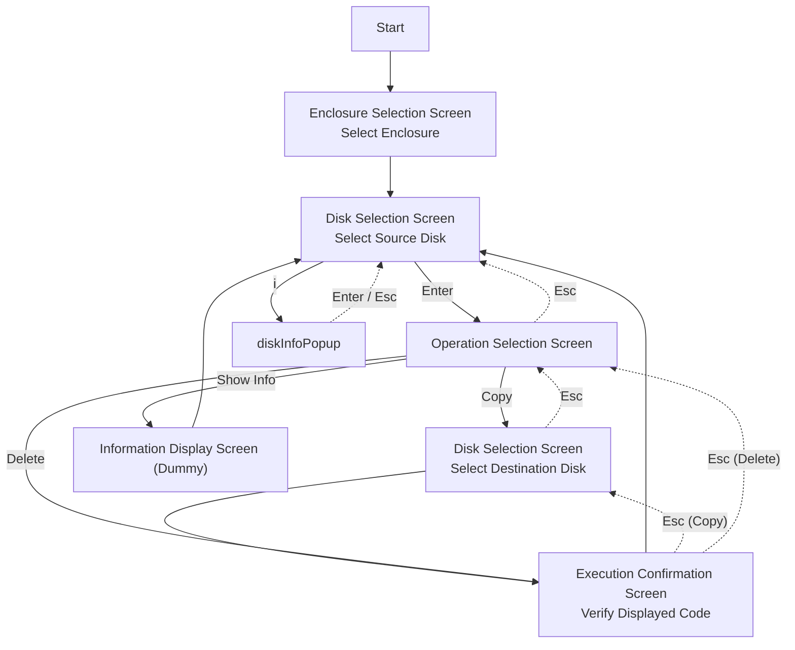

# diskman

## Screen Transitions



## Usage

### Build

```bash
go build -o diskman
```

### Startup

```bash
./diskman
```

For binary execution with options:

```bash
./diskman --config ~/.config/diskman/config.json
```

### Basic Operations

- `↑ ↓ ← →` or `h j k l`: Move disk cursor
- `Enter`: Confirm
- `Esc`: Back
- `↑ / ↓`: Seamlessly scroll between disks and job list on disk selection screen
- `Enter` while job selected: Show cancel confirmation popup
- `← / →` in confirmation popup: Select Yes/No
- `Enter` in confirmation popup: Confirm, `Esc`: Close
- `q`: Quit (unavailable if jobs are running)

### Workflows

**Copy:**
1. Select source disk
2. Choose "Copy" from operation menu
3. Select destination disk
4. Enter code shown on confirmation screen and press `Enter` to start

**Show Info:**
1. Select disk
2. Choose "Show Info" from operation menu
3. Dummy information is displayed (press `Enter` or `Esc` to go back)

**Delete:**
1. Select disk
2. Choose "Delete" from operation menu
3. Enter code shown on confirmation screen and press `Enter` to start

### In-Use Disk Labels

On the disk selection screen, the following labels are displayed based on running jobs:

- `[S1] JOB1 Source`
- `[D1] JOB1 Destination`
- `[E] Deleting`

In-use disks cannot be selected.

## Debug & Development

### Running from Source

For development and debugging:

```bash
go run main.go --debug --dry-run
```

When `--debug` is enabled, `/dev/diskN` is assigned to unset slots.

### Windows ddrescue Testing

On Windows, verify in the following order for safety:

1. Verify file-based copy behavior in WSL2
2. Verify behavior closer to block devices in VM
3. Final verification on physical disk if necessary

#### 1. WSL2 (Recommended)

Start with a file-based pseudo-disk. This allows verification of `Rate` / `Remain` / `pct rescued` without risking actual disks.

To test with a single command:

```bash
sudo apt update
sudo apt install -y gddrescue
cd /mnt/c/proj/diskman
bash scripts/wsl2-ddrescue-smoke.sh
```

Arguments (Optional):

- Arg 1: Working directory (default: `~/ddr-test`)
- Arg 2: File size (default: `1G`)
- Arg 3: Map file name (default: `run1.map`)

Example:

```bash
bash scripts/wsl2-ddrescue-smoke.sh ~/ddr-test 2G smoke.map
```

```bash
sudo apt update
sudo apt install -y gddrescue

mkdir -p ~/ddr-test
cd ~/ddr-test

# 1 GiB pseudo source/destination
truncate -s 1G src.img
truncate -s 1G dst.img

# Run
ddrescue -f src.img dst.img run1.map

# View map file content
cat run1.map
```

#### 2. VM (Verification closer to physical hardware)

Connect two additional disks to a Linux VM (Ubuntu recommended) and verify copying between `/dev/sdX` devices.

```bash
sudo apt update
sudo apt install -y gddrescue
lsblk

# 例: /dev/sdb -> /dev/sdc
sudo ddrescue -f /dev/sdb /dev/sdc vm-copy.map
```

Warning:

- Incorrect disk specification will destroy data.
- Always connect only test disks before executing.

#### 3. Docker (Supplementary)

Docker Desktop has limitations for direct block device access, so file-based verification is recommended.

```bash
# Image example (adjust based on the base image you use)
docker run --rm -it -v "$PWD:/work" ubuntu:24.04 bash

apt update
apt install -y gddrescue
cd /work
ddrescue -f src.img dst.img docker.map
```

## Safety Guidelines

- Do not run directly against production disks
- Keep map files separate for each job
- Always perform delete (ERASE) operations only on test disks