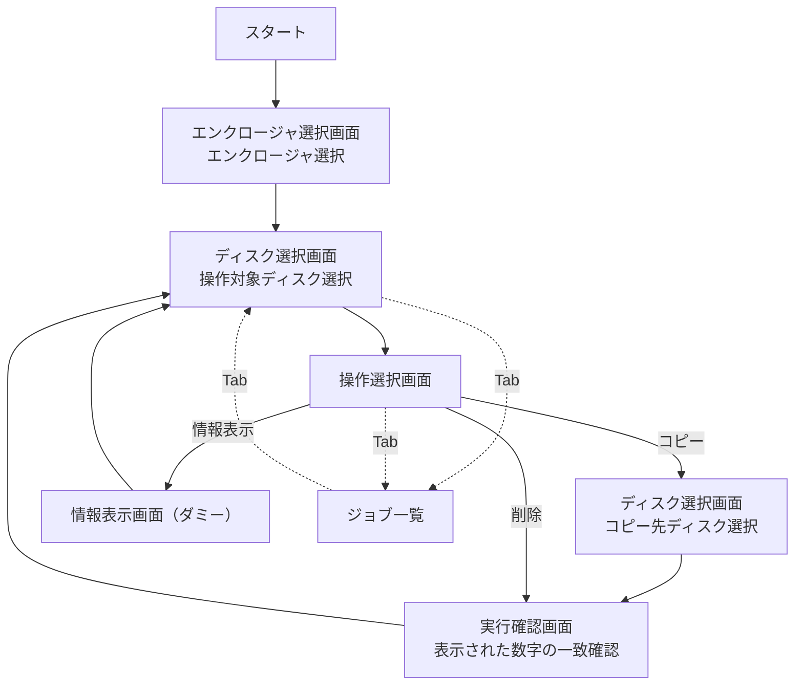

# diskman

## 画面遷移



## 利用方法

### 起動

```bash
go run main.go --debug --dry-run
```

`--debug` 時は未設定スロットに `/dev/diskN` を割り当てて動作します。

### 基本操作

- `↑ ↓ ← →` または `h j k l`: カーソル移動
- `Enter`: 決定
- `Esc`: 戻る
- `Tab`: ジョブ一覧とメイン画面を切り替え
- `q`: 終了（実行中ジョブがある場合は終了不可）

### フロー

1. コピー
1. ディスク選択（コピー元）
1. 操作選択で「コピー」
1. ディスク選択（コピー先）
1. 実行確認画面で表示された数字を入力し、`Enter` で開始

1. 情報表示
1. ディスク選択
1. 操作選択で「情報表示」
1. ダミー情報を表示（`Enter` / `Esc` で戻る）

1. 削除
1. ディスク選択
1. 操作選択で「削除」
1. 実行確認画面で表示された数字を入力し、`Enter` で開始

### 使用中ディスク表示

ディスク選択画面では、実行中ジョブに応じて以下のラベルを表示します。

- `[S1] JOB1 コピー元`
- `[D1] JOB1 コピー先`
- `[E] 削除中`

使用中のディスクは選択できません。