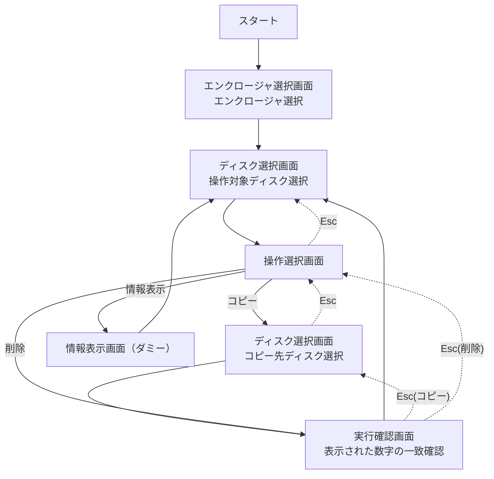

# diskman

## 画面遷移



## 利用方法

### 起動

```bash
go run main.go --debug --dry-run
```

`--debug` 時は未設定スロットに `/dev/diskN` を割り当てて動作します。

### 基本操作

- `↑ ↓ ← →` または `h j k l`: ディスクカーソル移動
- `Enter`: 決定
- `Esc`: 戻る
- `↑ / ↓`: ディスク選択画面でディスクとジョブ一覧をシームレスに移動
- ジョブ選択中に `Enter`: キャンセル確認ポップアップを表示
- キャンセル確認ポップアップで `← / →`: Yes/No 選択
- キャンセル確認ポップアップで `Enter`: 確定、`Esc`: 閉じる
- `q`: 終了（実行中ジョブがある場合は終了不可）

### フロー

1. コピー
1. ディスク選択（コピー元）
1. 操作選択で「コピー」
1. ディスク選択（コピー先）
1. 実行確認画面で表示された数字を入力し、`Enter` で開始

1. 情報表示
1. ディスク選択
1. 操作選択で「情報表示」
1. ダミー情報を表示（`Enter` / `Esc` で戻る）

1. 削除
1. ディスク選択
1. 操作選択で「削除」
1. 実行確認画面で表示された数字を入力し、`Enter` で開始

### 使用中ディスク表示

ディスク選択画面では、実行中ジョブに応じて以下のラベルを表示します。

- `[S1] JOB1 コピー元`
- `[D1] JOB1 コピー先`
- `[E] 削除中`

使用中のディスクは選択できません。

## Windowsでのddrescue実動確認

Windowsでは次の順で検証するのが安全です。

1. WSL2でファイルベースのコピー挙動を確認
1. VMでブロックデバイスに近い挙動を確認
1. 必要な場合のみ実機ディスクで最終確認

### 1. WSL2 (推奨)

最初はファイルを疑似ディスクとして使います。実ディスクを壊さずに、`Rate` / `Remain` / `pct rescued` を確認できます。

1コマンドで試す場合:

```bash
sudo apt update
sudo apt install -y gddrescue
cd /mnt/c/proj/diskman
bash scripts/wsl2-ddrescue-smoke.sh
```

引数（任意）:

- 第1引数: 作業ディレクトリ（既定: `~/ddr-test`）
- 第2引数: ファイルサイズ（既定: `1G`）
- 第3引数: mapfile名（既定: `run1.map`）

例:

```bash
bash scripts/wsl2-ddrescue-smoke.sh ~/ddr-test 2G smoke.map
```

```bash
sudo apt update
sudo apt install -y gddrescue

mkdir -p ~/ddr-test
cd ~/ddr-test

# 1 GiBの疑似ソース/コピー先
truncate -s 1G src.img
truncate -s 1G dst.img

# 実行
ddrescue -f src.img dst.img run1.map

# mapfileの内容確認
cat run1.map
```

### 2. VM (実機に近い確認)

Linux VM (Ubuntu推奨) に追加ディスクを2本接続し、`/dev/sdX` 間コピーを確認します。

```bash
sudo apt update
sudo apt install -y gddrescue
lsblk

# 例: /dev/sdb -> /dev/sdc
sudo ddrescue -f /dev/sdb /dev/sdc vm-copy.map
```

注意:

- ディスク指定を誤るとデータを破壊します。
- 必ずテスト用ディスクだけを接続して実行してください。

### 3. Docker (補助的)

Docker Desktopではブロックデバイス直アクセスに制約があるため、ファイルベース確認を推奨します。

```bash
# イメージ例（利用するベースイメージに応じて調整）
docker run --rm -it -v "$PWD:/work" ubuntu:24.04 bash

apt update
apt install -y gddrescue
cd /work
ddrescue -f src.img dst.img docker.map
```

## 安全ガイド

- 本番ディスクに対していきなり実行しない
- mapfileはジョブごとに分離する
- 消去(ERASE)は必ず検証用ディスクでのみ実施する